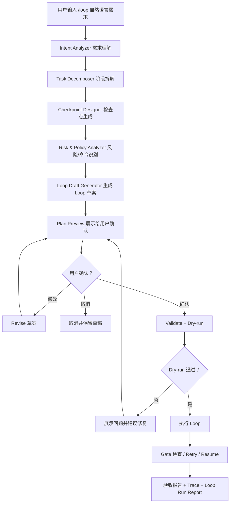

# Evolva `/loop` 通用编排能力产品设计

## 1. 产品目标

把 `/loop` 从“运行已存在 Loop”升级为 Evolva 的 **Intent-to-Loop 通用编排入口**。

用户不需要先懂 Loop JSON，也不需要手写 workflow。只需要输入一句自然语言需求，例如：

```text
/loop 帮我做一个响应式 SaaS landing page，有 hero、pricing、FAQ、移动端适配
```

Evolva 自动完成：

```text
用户需求
  -> 需求理解
  -> 任务拆解
  -> 风险识别
  -> 阶段设计
  -> 检查点设计
  -> Loop/Workflow 草案
  -> 用户确认/修改
  -> dry-run
  -> 执行
  -> 验收
  -> 生成报告
```

核心原则：

1. **默认不直接执行**：自然语言 `/loop xxx` 默认进入计划确认，而不是立即改代码。
2. **通用，不绑定网页场景**：网页、代码重构、测试补齐、文档生成、发布检查、数据处理都走同一套抽象。
3. **确认优先**：Evolva 必须把阶段、风险、检查点讲清楚，用户确认后才执行。
4. **可审计**：生成的 plan、loop spec、dry-run、执行结果都要落盘。
5. **可复用**：用户确认后的 Loop 可以保存为 reusable loop。
6. **有界执行**：Loop 不是无限循环。每个 Loop 都必须有明确的阶段图、重试次数、修复轮次、超时、预算和终止条件。

---

## 1.1 Loop 不是无限循环

这里的 `loop` 表示“工程闭环”，不是无终止的 `while true`。

生产级 `/loop` 必须满足以下终止规则：

1. **阶段图必须是 DAG**
   - 每个 phase 只能依赖已经存在的 phase；
   - 不允许循环依赖；
   - `validate` 阶段必须拒绝 `A -> B -> A` 这类配置。

2. **每个 phase 的重试次数有上限**
   - 默认 `retries = 0`；
   - 自动生成的 Loop 建议最多 `retries <= 1`；
   - 高成本或高风险阶段必须 `retries = 0`，失败后交给用户确认。

3. **自动修复迭代必须有上限**
   - 如果 V2 支持“失败后自动修复再检查”，必须引入 `max_repair_rounds`；
   - 默认 `max_repair_rounds = 1`；
   - 上限建议不超过 `3`；
   - 超过上限后状态变为 `needs_user_review`，不能继续自动跑。

4. **全局执行预算必须有上限，但不是固定 180 秒**
   - `max_total_phases`：最多执行多少个阶段；
   - `max_duration_seconds`：最长运行时间；
   - `max_tool_calls`：最多工具调用次数；
   - `max_command_runs`：最多 shell 命令次数；
   - `max_file_changes`：最多修改文件数量，超过后要求用户确认。
   - 预算应该按任务类型和项目规模自适应生成，不能把所有 Loop 都写死为 180 秒。

5. **失败终止优先于盲目继续**
   - required checkpoint 失败时默认停止；
   - 只有显式 `continue_on_error=true` 的非关键阶段可以继续；
   - destructive、高风险、权限相关操作失败后必须停止。

6. **执行前必须 dry-run**
   - dry-run 需要展示阶段数量、命令、allowlist、预算、终止条件；
   - 用户确认后才允许进入 execute。

建议默认执行边界：

```json
{
  "execution_limits": {
    "max_total_phases": 12,
    "max_repair_rounds": 1,
    "max_phase_retries": 1,
    "max_duration_seconds": 1800,
    "max_tool_calls": 40,
    "max_command_runs": 10,
    "max_file_changes": 30
  }
}
```

其中 `180` 秒更适合作为**单个短命令 phase 的默认 timeout**，例如 `npm run build`、`pytest tests/test_x.py`、`ruff check`。完整 Loop 的全局超时建议默认 `1800` 秒，并根据任务规模调整：

| 场景 | 单 phase timeout | 全局 timeout | 说明 |
| --- | ---: | ---: | --- |
| 文档/分析类 | 60-180s | 300-600s | 通常不需要长时间执行命令 |
| 小型网页/组件改动 | 180-300s | 900-1800s | 包含实现、build、预览检查 |
| 中型 feature/bugfix | 300-600s | 1800-3600s | 可能需要测试和一轮修复 |
| 大型重构/迁移 | 600-1200s | 3600s+ | 必须拆成多个 Loop，不能单次无限跑 |

超过预算后的正确行为不是继续循环，而是生成 `needs_user_review` 报告，说明：已完成阶段、失败点、剩余风险、是否建议用户扩大预算或拆分任务。

---

## 2. 用户体验设计

### 2.1 一句话入口

用户输入：

```text
/loop 帮我做一个网页，介绍我的 AI 简历生成器，要求有上传入口、示例预览、价格卡片和移动端适配
```

Evolva 不会立刻执行，而是返回一个结构化计划确认页：

```text
我会把这个需求拆成一个可执行 Loop。当前理解如下：

目标：
- 构建一个 AI 简历生成器介绍页
- 包含上传入口、示例预览、价格卡片、移动端适配

建议阶段：
1. 需求澄清与页面信息架构
2. 现有项目结构识别
3. UI/组件实现
4. 构建检查
5. 浏览器预览检查
6. 视觉/响应式验收
7. 修复迭代
8. 最终报告

关键检查点：
- 页面能成功构建
- 主入口按钮可见
- pricing 区块存在
- 移动端布局不溢出
- 浏览器无明显 console error
- 最终输出包含访问方式和改动摘要

需要你确认：
A. 直接使用这个流程
B. 修改阶段/检查点
C. 只生成 Loop，不执行
```

用户可以回复：

```text
确认执行
```

或者：

```text
加一个 SEO meta 检查
```

或者：

```text
不要浏览器检查，只跑 build
```

---

## 3. 新 `/loop` 命令语义

现有 `/loop list`、`/loop run`、`/loop dry-run` 保留。

新增自然语言模式：

```text
/loop <自然语言需求>
```

等价于：

```text
/loop plan <自然语言需求>
```

建议完整命令族：

```text
/loop <需求>                         自动进入需求拆解和确认
/loop plan <需求>                    只生成计划，不执行
/loop revise <修改意见>              修改当前 Loop 草案
/loop confirm                        确认当前草案，进入 dry-run
/loop execute                        执行已确认的 Loop
/loop save <name>                    保存当前 Loop 为 reusable spec
/loop show-draft                     查看当前草案
/loop cancel                         取消当前草案
```

已有命令继续保留：

```text
/loop list
/loop show <loop>
/loop validate <loop>
/loop dry-run <loop>
/loop run <loop>
```

### 3.1 兼容策略

命令解析优先级：

```text
如果 /loop 后第一个 token 是 list/show/validate/dry-run/run/save/confirm 等保留词：
    走现有命令
否则：
    进入自然语言 Loop Planner
```

例如：

```text
/loop run dream-loop
```

仍然是运行已有 Loop。

```text
/loop 帮我做一个网页
```

进入自动拆解。

---

## 4. 核心产品流程



---

## 5. 阶段拆解模型

自动生成的 Loop 应包含两类阶段：

1. **Planning Phases**：理解、设计、确认。
2. **Execution Phases**：实现、检查、修复、验收。

通用模板：

```text
1. intent_analysis
   理解用户目标、产出物、边界、成功标准

2. context_scan
   扫描当前项目结构、技术栈、可用命令、风险点

3. implementation_plan
   生成具体执行计划和文件级改动范围

4. user_confirmation
   等待用户确认计划

5. implementation
   执行代码/文档/配置修改

6. verification
   跑测试、build、lint、静态检查或领域检查

7. review_and_fix
   根据失败结果修复

8. acceptance_report
   生成最终报告
```

不同任务类型会映射不同检查点。

---

## 6. 通用任务类型识别

Evolva 应该先判断用户需求属于哪类：

| 类型 | 示例 | 推荐检查点 |
| --- | --- | --- |
| `web_feature` | 做网页、页面、组件、样式 | build、浏览器预览、响应式、console error |
| `code_feature` | 加功能、接口、业务逻辑 | 单测、集成测试、类型检查 |
| `bugfix` | 修 bug、报错、失败测试 | 复现、修复、回归测试 |
| `refactor` | 重构、抽象、拆模块 | 测试不回归、API 兼容 |
| `docs` | 写 README、文档、教程 | 链接、示例命令、格式 |
| `release` | 发布前检查 | full test、CLI help、版本信息 |
| `analysis` | 分析项目、给方案 | 证据引用、风险列表、无需执行 |
| `data_task` | 处理文件、表格、转换 | 输入输出校验、样本检查 |

用户说“做个网页”时，识别为：

```json
{
  "intent_type": "web_feature",
  "requires_code_change": true,
  "requires_browser_check": true,
  "requires_user_confirmation": true
}
```

---

## 7. 自动生成的确认页设计

用户确认前，Evolva 应展示一个结构化预览，而不是直接丢 JSON。

示例：

```text
Loop Draft: web-delivery-ai-resume-page

目标
- 构建 AI 简历生成器介绍页
- 包含上传入口、示例预览、价格卡片、移动端适配

我计划修改
- 识别项目入口后再确定具体文件
- 预计涉及页面组件、样式、可能的路由配置

阶段
1. context_scan
   - 扫描项目技术栈和启动/build 命令
2. product_design
   - 生成页面结构、内容模块、验收标准
3. implementation
   - 实现页面和样式
4. build_check
   - 执行项目 build
5. browser_check
   - 打开本地页面，检查首屏、移动端、console
6. fix_iteration
   - 根据检查结果修复
7. final_report
   - 输出改动摘要、运行方式、残留风险

检查点
- 页面包含 hero/upload CTA/preview/pricing/FAQ
- 移动端无横向溢出
- build 成功
- 无明显 console error
- 最终报告包含访问 URL 和验证结果

需要执行的命令候选
- npm run build
- npm run dev
- npm run test 或 npm run lint，如果项目存在

安全策略
- 所有 shell 命令会先进入 command_allowlist
- dry-run 通过后才执行
- 不会执行 destructive 命令

请回复：
- 确认执行
- 修改：<你的修改意见>
- 只保存不执行
- 取消
```

---

## 8. Loop Draft 数据结构

新增一个内部对象：`LoopDraft`。

```python
@dataclass
class LoopDraft:
    draft_id: str
    user_request: str
    intent_type: str
    goal: str
    assumptions: list[str]
    open_questions: list[str]
    phases: list[DraftPhase]
    checkpoints: list[DraftCheckpoint]
    command_candidates: list[str]
    risks: list[str]
    execution_limits: DraftExecutionLimits
    loop_spec: LoopSpec
    workflow_spec: dict | None
    status: Literal[
        "draft",
        "awaiting_confirmation",
        "confirmed",
        "dry_run_failed",
        "ready_to_run",
        "running",
        "completed",
        "cancelled"
    ]
```

其中 `DraftExecutionLimits`：

```python
@dataclass
class DraftExecutionLimits:
    max_total_phases: int = 12
    max_repair_rounds: int = 1
    max_phase_retries: int = 1
    max_duration_seconds: int = 1800
    max_tool_calls: int = 40
    max_command_runs: int = 10
    max_file_changes: int = 30
```

其中 `DraftPhase`：

```python
@dataclass
class DraftPhase:
    id: str
    title: str
    purpose: str
    type: Literal["agent", "tool", "dream", "role"]
    depends_on: list[str]
    expected_output: str
    user_visible: bool
```

`DraftCheckpoint`：

```python
@dataclass
class DraftCheckpoint:
    id: str
    after_phase: str
    type: Literal[
        "phase_success",
        "command_success",
        "output_contains",
        "browser_check",
        "manual_confirmation"
    ]
    description: str
    required: bool
```

---

## 9. 生成的 Loop Spec 示例

用户需求：

```text
/loop 做一个 AI 简历生成器 landing page，有上传入口、示例预览、价格卡片、FAQ，移动端适配
```

Evolva 生成草案：

```json
{
  "id": "generated-web-ai-resume-landing",
  "name": "AI Resume Landing Page Delivery Loop",
  "description": "Deliver a responsive landing page from a natural language request.",
  "trigger": {
    "type": "manual",
    "source": "loop_planner"
  },
  "command_allowlist": [
    "npm run build",
    "npm run lint",
    "npm run test",
    "npm run dev*"
  ],
  "execution_limits": {
    "max_total_phases": 8,
    "max_repair_rounds": 1,
    "max_phase_retries": 1,
    "max_duration_seconds": 1800,
    "max_tool_calls": 30,
    "max_command_runs": 6,
    "max_file_changes": 20
  },
  "phases": [
    {
      "id": "context_scan",
      "type": "agent",
      "prompt": "Scan the repository structure and infer the frontend framework, build command, app entrypoints, and likely files to edit."
    },
    {
      "id": "product_design",
      "type": "agent",
      "depends_on": ["context_scan"],
      "prompt": "Create a concise product/page design for the requested landing page. Include sections, content hierarchy, responsive behavior, and acceptance criteria. User request: {{user_request}}"
    },
    {
      "id": "implementation",
      "type": "agent",
      "depends_on": ["product_design"],
      "prompt": "Implement the page according to the design and acceptance criteria. Preserve existing style and avoid unrelated changes."
    },
    {
      "id": "build_check",
      "type": "tool",
      "tool": "shell",
      "depends_on": ["implementation"],
      "args": {
        "command": "npm run build"
      },
      "timeout": 180,
      "retries": 1
    },
    {
      "id": "final_report",
      "type": "agent",
      "depends_on": ["build_check"],
      "prompt": "Summarize implemented changes, verification results, residual risks, and how the user can run or view the page."
    }
  ],
  "gates": [
    {
      "after": "build_check",
      "type": "phase_success"
    }
  ],
  "artifacts": [
    "trace",
    "loop_report",
    "implementation_summary"
  ]
}
```

如果当前项目没有 `npm run build`，dry-run/context_scan 阶段应该建议替换为实际命令，比如：

```text
pnpm build
uv run ...
python -m pytest
```

---

## 10. 用户确认机制设计

### 10.1 默认必须确认

自然语言生成的 Loop 默认状态：

```text
awaiting_confirmation
```

用户必须明确回复：

```text
确认执行
```

或者：

```text
/loop confirm
```

才进入：

```text
validate -> dry-run -> execute
```

### 10.2 可修改

用户可以说：

```text
修改：不要 pricing，增加 testimonials
```

Evolva 应重新生成：

- 目标；
- 阶段；
- 检查点；
- Loop spec；
- command allowlist。

然后再次展示确认页。

### 10.3 自动判断是否需要提问

如果需求缺关键条件，Evolva 不应该硬跑。

例如：

```text
/loop 帮我重构认证系统
```

这类高风险需求应先问：

```text
这个需求会影响认证逻辑。执行前我需要确认：
1. 是否允许修改登录/注册流程？
2. 是否需要保持现有 API 兼容？
3. 当前是否有必须通过的测试命令？
```

但对低风险任务，比如：

```text
/loop 帮我更新 README，补充安装说明
```

可以直接给 plan + confirmation，不一定追问。

---

## 11. Checkpoint 设计

Checkpoint 分为四类。

### 11.1 Structural Checkpoint

检查产物是否存在。

例如网页任务：

```text
- 是否有 hero section
- 是否有 CTA button
- 是否有 pricing card
- 是否有 FAQ
```

### 11.2 Command Checkpoint

跑命令。

```text
- npm run build
- npm run lint
- pytest
- uv run ...
```

对应 gate：

```json
{
  "type": "command_success",
  "command": "npm run build"
}
```

### 11.3 Semantic Checkpoint

由 agent 判断输出是否满足需求。

```text
- 页面内容是否覆盖用户需求
- 文档是否解释清楚安装步骤
- 重构是否保留原有行为
```

### 11.4 Human Checkpoint

需要用户确认。

```text
- 是否接受当前产品设计？
- 是否确认执行会修改这些文件？
- 是否确认发布前检查通过即可继续？
```

这个是当前 Loop Engine 需要新增的一等 gate：

```json
{
  "type": "manual_confirmation",
  "after": "product_design",
  "prompt": "请确认这个产品设计和执行计划是否合理。"
}
```

---

## 12. 和 Workflow 的关系

建议产品上这样区分：

### Loop

面向用户和产品语义：

```text
目标、阶段、检查点、风险、验收、报告
```

### Workflow

面向底层执行：

```text
具体 tool 调用、agent 调用、命令、依赖 DAG
```

所以自然语言 `/loop` 生成时可以同时生成：

```text
Loop Draft
  -> Loop Spec
  -> Optional Workflow Spec
```

设计原则：

- 用户主要看 Loop Draft。
- 系统执行时可以转成 Workflow。
- Loop Report 负责汇总结果。

---

## 13. 需要新增的模块

建议新增这些模块：

```text
evolva/loops/planner.py
evolva/loops/draft.py
evolva/loops/checkpoints.py
evolva/loops/templates.py
evolva/loops/session.py
```

### 13.1 `LoopIntentAnalyzer`

负责把自然语言变成结构化意图。

```python
class LoopIntentAnalyzer:
    def analyze(self, request: str, context: RepoContext) -> LoopIntent:
        ...
```

输出：

```json
{
  "intent_type": "web_feature",
  "goal": "...",
  "requires_code_change": true,
  "requires_browser_check": true,
  "risk_level": "medium"
}
```

### 13.2 `LoopDecomposer`

负责阶段拆解。

```python
class LoopDecomposer:
    def decompose(self, intent: LoopIntent) -> list[DraftPhase]:
        ...
```

### 13.3 `CheckpointDesigner`

负责生成检查点。

```python
class CheckpointDesigner:
    def design(self, intent: LoopIntent, phases: list[DraftPhase]) -> list[DraftCheckpoint]:
        ...
```

### 13.4 `LoopSpecSynthesizer`

负责生成可执行 spec。

```python
class LoopSpecSynthesizer:
    def synthesize(self, draft: LoopDraft) -> LoopSpec:
        ...
```

### 13.5 `LoopDraftSession`

负责 TUI/CLI 当前草案状态。

```python
class LoopDraftSession:
    def create(request: str) -> LoopDraft: ...
    def revise(feedback: str) -> LoopDraft: ...
    def confirm() -> LoopDraft: ...
    def cancel() -> None: ...
```

---

## 14. 当前 `/loop` 产品行为建议

### 14.1 输入自然语言

```text
/loop 做一个 AI 简历生成器网页
```

行为：

```text
生成 Loop Draft
状态 awaiting_confirmation
不执行
```

### 14.2 用户确认

```text
/loop confirm
```

行为：

```text
validate generated loop
dry-run generated loop
如果通过，询问是否执行
```

可以简化成：

```text
/loop confirm --run
```

直接：

```text
confirm -> dry-run -> execute
```

### 14.3 用户修改

```text
/loop revise 增加深色模式检查，不要 pricing
```

行为：

```text
更新 draft
重新展示确认页
```

### 14.4 保存模板

```text
/loop save web-landing-delivery
```

行为：

```text
保存到 evolva/loops/generated/web-landing-delivery.json
```

---

## 15. 一个完整交互示例

用户：

```text
/loop 做一个 AI 简历生成器 landing page，有上传入口、示例预览、价格卡片、FAQ，移动端适配
```

Evolva：

```text
我已生成 Loop 草案：generated-web-ai-resume-landing

目标：
构建一个 AI 简历生成器介绍页，包含上传入口、示例预览、价格卡片、FAQ 和移动端适配。

阶段：
1. context_scan
   扫描项目结构、技术栈、可用构建命令
2. product_design
   生成页面结构、文案层级、响应式规则和验收标准
3. implementation
   实现页面和样式
4. build_check
   运行构建命令
5. browser_check
   打开本地页面，检查首屏、移动端和 console
6. fix_iteration
   根据失败检查修复
7. final_report
   汇总改动、验证结果、运行方式和风险

检查点：
- 页面包含 hero、上传 CTA、示例预览、pricing、FAQ
- 移动端布局不溢出
- build 成功
- 无明显 console error
- 最终报告包含访问方式

候选命令：
- npm run build
- npm run dev

风险：
- 需要先确认当前项目是否是前端项目
- 如果没有浏览器运行环境，将降级为 build/static 检查
- shell 命令必须通过 allowlist 和 policy

请回复：
- /loop confirm
- /loop revise <修改意见>
- /loop save <name>
- /loop cancel
```

用户：

```text
/loop revise 加一个深色模式，不需要 pricing
```

Evolva：

```text
已更新草案：
- 移除 pricing
- 增加 dark mode section/checkpoint
- 检查点增加：暗色模式下文字可读、背景对比正常

是否确认？
```

用户：

```text
/loop confirm
```

Evolva：

```text
Dry-run:
- Loop spec valid
- shell command allowlist ok
- tools available
- policy ok

是否执行？
回复：
- /loop execute
- /loop cancel
```

用户：

```text
/loop execute
```

Evolva 开始执行。

---

## 16. 产品分层与实施路径

### V1：通用 Loop Planner

目标：先实现“自动拆分 + 用户确认”。

能力：

- `/loop <自然语言需求>`
- 自动生成阶段和检查点
- 展示确认页
- `/loop revise`
- `/loop confirm`
- 生成 Loop spec
- dry-run

第一期不一定自动改代码，重点是把需求转成可靠计划和可执行 spec。

### V2：执行闭环

能力：

- `/loop execute`
- 自动运行生成的 Loop
- 支持失败修复迭代
- 支持 resume
- 生成最终报告

### V3：领域模板

能力：

- web feature template
- bugfix template
- refactor template
- docs template
- release template
- eval template

让自然语言生成更稳定。

---

## 17. 成功标准

这个能力产品化完成，需要满足：

1. 用户输入 `/loop <需求>` 后不会直接执行，而是生成可读计划。
2. 计划包含：
   - 目标；
   - 阶段；
   - 检查点；
   - 风险；
   - 需要执行的命令；
   - 是否需要用户确认。
3. 用户可以修改计划。
4. 用户确认后自动生成 Loop spec。
5. dry-run 能检查：
   - 工具是否存在；
   - shell 命令是否 allowlisted；
   - policy 是否允许；
   - 阶段/gate 是否合法。
6. 执行边界可见且强制生效：
   - phase DAG 无循环依赖；
   - 每个 phase retry 有上限；
   - 自动修复轮次有上限；
   - 总时长、工具调用、命令执行、文件修改数量有上限。
7. required checkpoint 失败后默认停止，不允许无限修复循环。
8. 通过 dry-run 后才能执行。
9. 执行后有 Loop report 和 Trace。
10. 生成的 Loop 可以保存和复用。
11. 对网页、bugfix、文档、测试补齐等不同任务有不同模板。
12. 高风险任务必须触发额外确认。

---

## 18. 一句话产品定义

`/loop` 是 Evolva 的通用工程意图编排入口：它把用户的一句话需求转化为可确认的阶段计划、检查点和可执行 Loop，在执行前完成安全预检和用户确认，在执行后留下 Trace、报告和可复用能力资产。

---

## 19. 和当前能力的差距

当前已经有：

- Loop Runner；
- Loop spec；
- phase/gate；
- validate；
- dry-run；
- allowlist；
- retry；
- resume；
- trace/report。

还需要新增：

- 自然语言 Intent Analyzer；
- Loop Draft；
- Checkpoint Designer；
- Plan Preview；
- 用户确认状态机；
- `/loop revise / confirm / execute / save`；
- 通用模板库；
- 可选 Workflow spec 生成。

该方案可以直接基于当前 Loop Engine 实现，不需要推倒重来。
